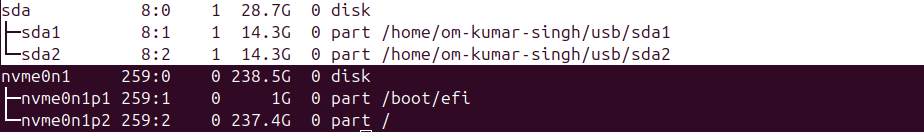
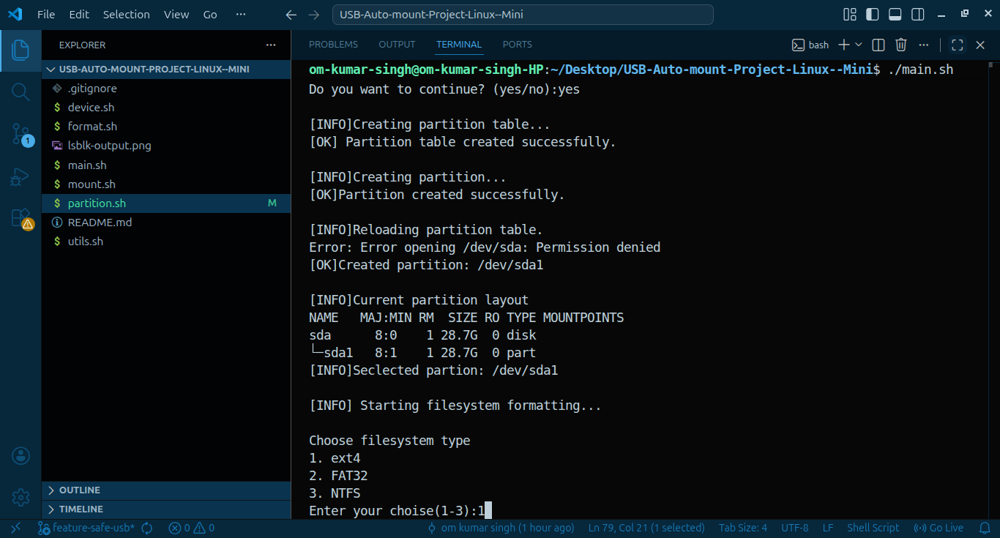
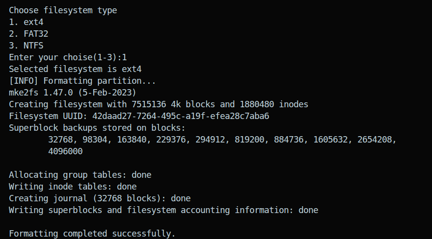
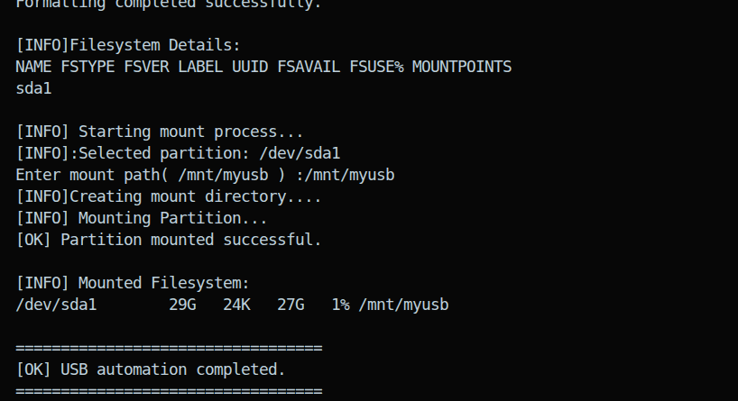
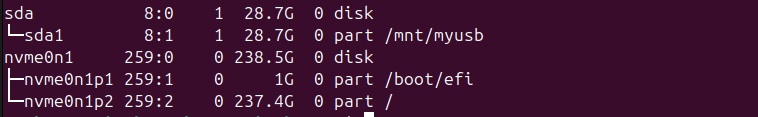

<<<<<<< HEAD
# USB Auto-Mount Project(Linux)

## Overview:This project demonstrates how to automatically mount a USB pendrive in Linux using UUID and /etc/fstab
## Instead of mounting manually every time,the USB now mounts automatically to a fixed directory.
=======
# Linux USB Automation Tool

## Description
>>>>>>> feature-safe-usb

Linux USB Automation Tool is a Bash scripting project that automates USB storage management tasks such as:

<<<<<<< HEAD
### Problem:
 When plugging in a USB device:
 It mounts to random locations
 Device name changes
 Manual mounting is required each time

## Solution:
 Used UUID for stable identification
 Configured /etc/fstab for auto-mount
 Created custom mount points

Setup Script
./setup-usb.sh

# Auto-Mount Configuration

The USB is configured to mount automatically using `/etc/fstab` and UUID.

###  Steps

#### 1. Get UUID
```bash
   lsblk -f
```

#### 2. Create mount points

```bash
mkdir -p ~/usb/sda1
mkdir -p ~/usb/sda2
```

#### 3. Edit fstab

```bash
sudo nano /etc/fstab
```

Add entries:

```
UUID=XXXX   /home/user/usb/sda1   ext4    defaults,user   0   0
UUID=XXXX   /home/user/usb/sda2   exfat   defaults,user   0   0
```

#### 4. Apply configuration

```bash
sudo mount -a
```

---

##  Testing

1. Unplug the USB device
2. Plug it again
3. Run:

```bash
lsblk
```
### Screen Shot of Result

=======
- Device detection and validation
- Partition table creation
- Partition creation
- Filesystem formatting
- Mounting partitions

The project is designed for learning Linux system administration, Bash scripting, and storage automation concepts.
>>>>>>> feature-safe-usb


## Features

- USB device validation
- Confirmation-based safety system
- Partition table creation (GPT/MSDOS)
- Single partition creation
- Filesystem formatting
  - ext4
  - FAT32
  - NTFS
- Partition mounting
- Error handling and validation
- Modular Bash scripting structure

## Screenshots







 




